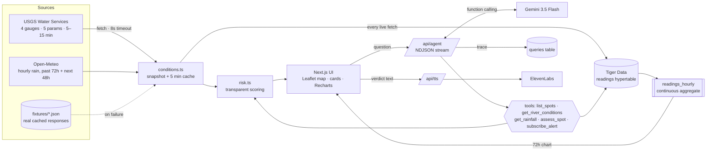

# 🌊 Schuylkill Sentinel

**Know before you go: live sewage-overflow and river-safety risk for Philly's waterfronts.**

Built at **OwlHacks 2026** (Temple University) by **Arbaz** and **Soundarya**.
Repo: https://github.com/karbaz017/schuylkill-sentinel

---

## The problem

Philadelphia has a *combined* sewer system: the same pipes carry stormwater and household sewage. When it rains hard, and often it takes only ~¼–½ inch, the pipes overflow by design into the Schuylkill and Delaware through roughly 160 outfalls. These are **combined sewer overflows (CSOs)**: raw sewage in the water where people row, kayak, fish, and walk their dogs.

The data to predict this is public (USGS river gauges, rainfall), but it's scattered across agency sites and written for hydrologists. A rower at Boathouse Row at 6 AM just wants to know one thing: **is the water OK today?**

## What it does

- **Live map** of six riverfront spots (Boathouse Row, Schuylkill Banks, Bartram's Garden, Manayunk, Penn's Landing, Tacony/Pennypack), each scored **0–100** and colored **Green / Yellow / Red**.
- **Spot cards** show the score, a go/caution/no verdict per activity (rowing, kayaking, fishing, dogs and wading, walking, and swimming, which is always no), *every* reason behind the score, and a 72-hour rain + gauge chart.
- **An AI agent (Gemini)** answers questions like *"Can I kayak at Bartram's Garden tomorrow morning?"* It calls real tools (USGS gauges, rainfall, the risk model) and streams a **visible reasoning trace**: thoughts, each tool call and result, then a one-line verdict.
- **Read aloud** plays the verdict with ElevenLabs (useful at the dock with gloves on), falling back to the browser's voice.
- **Alerts** let you subscribe an email to a spot's Red or Yellow status (stored in Tiger Data; delivery is mocked for the demo).
- **Demo mode** replays a realistic 1.6″ thunderstorm over cached real data, so you can see the red state on a dry day.
- **It never goes blank.** Every external API has a real cached fixture, and a banner tells you when you're looking at cached data.

## How it works



### Data sources (what we actually found)

We queried every gauge before writing the model. All four report all five parameters (gage height, discharge, water temp, turbidity, dissolved oxygen).

| Gauge | USGS site | Used for | Notes |
|---|---|---|---|
| Schuylkill at Philadelphia (Fairmount Dam) | 01474500 | Boathouse Row, Schuylkill Banks, Bartram's | 15-min data |
| Schuylkill at Norristown | 01473500 | Manayunk | The brief listed 01474000, which is actually *Wissahickon Creek at Mouth*, so we switched to the real Norristown main-stem gauge |
| Delaware at Penn's Landing | 01467200 | Penn's Landing | Tidal. Water-quality sensors on a USGS barge publish in a second "method" block, and the parser picks the freshest one. Discharge here is tidal flow, so we skip it. |
| Delaware at Trenton | 01463500 | Tacony/Pennypack (upstream indicator) | Non-tidal |

Rain comes from Open-Meteo (hourly, mm → inches) at a Philadelphia grid point. Seasonal "normal" flow comes from USGS daily-median statistics, averaged per month (see `data/gauges.ts`).

### The risk model (`lib/risk.ts`)

The model is deliberately simple and fully explainable. Each factor adds points and a human-readable reason, and the UI and the agent show exactly the same reasons.

| Factor | Rule | Points |
|---|---|---|
| **CSO likelihood** | ≥ 0.50 in of rain in a 24h window | **+40** |
| | ≥ 0.25 in in a 24h window | **+20** |
| **48h decay** | Full weight for 24h after the rain stops, then linear to 0 at 48h (sewage lingers) | × 1 → 0 |
| **Outfall exposure** | Spot-level weight: high (tidal lower Schuylkill, Penn's Landing) ×1.25, low (Manayunk) ×0.75 | × |
| **Saturated ground** | ≥ 1.0 in in 48h | **+15** |
| **Turbidity** | > 50 FNU / > 100 FNU | **+20 / +30** |
| **Gauge rise** | Gage up > 1 ft in 24h (skipped on tidal gauges) | **+15** |
| **High flow** | Discharge ≥ 3× the monthly median | **+10** |
| **Low oxygen** | DO < 5 mg/L | **+5** |
| **Cold water** | < 10 °C: cold-shock warning | 0 (warning) |
| **Forecast** | > 0.5 in expected in the next 24h: "likely to worsen" | 0 (warning) |
| **Tidal spot** | "Tide moves water both ways, treat as approximate" | 0 (note) |
| **Missing sensor** | Factor skipped, with a reason saying so | 0 |

**Bands:** 0–33 **Green · Safe**, 34–66 **Yellow · Caution**, 67–100 **Red · Avoid**.

**Activities** have different tolerances, because contact with the water differs:

| Activity | Go if score ≤ | Caution if ≤ | Otherwise |
|---|---|---|---|
| Walking / running | 66 | always caution (flooded paths), never a hard no | |
| Fishing | 40 | 70 | no (and don't eat the catch) |
| Rowing | 33 | 60 | no |
| Kayaking | 28 | 55 | no |
| Dogs / wading | 15 | 33 | no |
| Swimming | never | | always no |

**Future times** ("tomorrow morning") rescore the rain windows using forecast precipitation. Gauge readings stay current, and the reason says so.

**Why these thresholds?** Philadelphia Water Department's CSO guidance and its (former) CSOcast tool treat roughly a quarter to half inch of rain as enough to trigger overflows at many outfalls. Water-quality advisories typically last 24–48h after rain. The turbidity and flow thresholds come from the real ranges we observed (Fairmount at ~5 FNU and 1,200 cfs on a calm day, versus hundreds of FNU after storms). This is a screening heuristic, not a bacteria measurement. See "What's next".

### Why time-series storage matters (Tiger Data)

River data is a time series. Every question we answer is about **change over a window**: rain in the last 24h, how fast the river rose, how long since the storm ended. So we store it the way it's shaped:

- **`readings` hypertable**: every USGS and Open-Meteo sample we fetch (~7,000 rows per 72h fetch across 4 gauges × 5 params at 5–15 min), partitioned into 1-day chunks. The `(site_id, parameter, time)` unique key makes re-fetching the overlapping 72h window idempotent.
- **`readings_hourly` continuous aggregate**: `time_bucket('1 hour')` avg/min/max/sum per series, refreshed every 15 min by a policy, with real-time aggregation for the newest hour. **The 72h chart on every spot card reads from it**, so the database does the rollup, not the browser.
- **Compression policy** on chunks older than 7 days, segmented by `site_id, parameter`. That keeps a season of 5-minute data cheap, so we can later learn *per-spot* thresholds from history.
- **`queries`** stores every agent reasoning trace (JSONB) for auditing, and **`subscriptions`** stores alerts.

USGS only serves recent instantaneous values quickly. By persisting what we fetch, Sentinel builds its own history, which is exactly what you need to calibrate the model against real overflow events. Without a database the app falls back to an in-memory store and everything still works (`lib/db.ts`).

### The agent (`lib/agent/`)

- Uses `@google/genai`, **gemini-3.5-flash** (falling back to 2.5-flash), with function calling, low thinking, and thought summaries streamed to the UI.
- One code path covers two backends: `GEMINI_API_KEY` uses the Developer API, and `GOOGLE_CLOUD_PROJECT` uses Vertex AI with ADC.
- `/api/agent` streams **NDJSON events** (`meta`, `thought`, `tool_call`, `tool_result`, `final`, `done`), and the trace UI renders them live.
- **No Gemini, a quota error, or a network failure?** The offline agent runs the *same tools on the same data* and templates the answer, and the trace says why it switched. The demo never crashes.
- System prompt rules: always call tools, be concise, never encourage swimming, flag tidal uncertainty and missing data, and end with a one-line verdict.

## Tracks and prizes

- **Sustainability**: public health, urban water, and making environmental data usable.
- **AI & Agents**: tool-using Gemini agent with a transparent, streamed reasoning trace.
- **Philly Special**: the Schuylkill, Boathouse Row, Bartram's Garden, and the city's CSO problem.
- **Best Use of Gemini API**: function calling, parallel tool calls, thought summaries, Vertex and API-key backends.
- **Best Use of Tiger Data**: hypertable, continuous aggregate powering the chart, compression policy, trace store.
- **Best Use of ElevenLabs**: the verdict is read aloud.
- **Best Use of Vultr**: Dockerfile and Vultr deployment (`DEPLOY.md`).
- **Best Domain Name from GoDaddy Registry**

## Run it locally

```bash
git clone https://github.com/karbaz017/schuylkill-sentinel && cd schuylkill-sentinel
npm install
cp .env.example .env.local     # optional: add GEMINI_API_KEY / DATABASE_URL / ELEVENLABS_API_KEY
npm run dev                    # http://localhost:3000   (add ?demo=1 for the storm)
```

With `gcloud auth application-default login` done, `GOOGLE_CLOUD_PROJECT=<id>` alone enables Gemini via Vertex.

```bash
npm run test        # vitest: risk model, parsers, agent route, fallbacks (48 tests)
npm run lint && npm run typecheck && npm run build
TEST_DATABASE_URL=postgres://… npm test   # also runs the database integration test
npm run fixtures:refresh                  # re-capture real USGS/Open-Meteo responses for offline use
```

Deployment (Vultr, Docker, Vercel): see **[DEPLOY.md](DEPLOY.md)**.

## Resilience scenarios (all tested)

| Scenario | Behaviour | Where |
|---|---|---|
| Normal day | Live data, per-spot scores | `tests/risk.test.ts` (real fixtures) |
| Heavy rain | Red markers, CSO reason, agent says avoid | demo mode · `tests/agent.test.ts` |
| USGS down / Open-Meteo down | Fixture data + "showing cached data from …" banner | `tests/agent.test.ts` |
| Gemini missing or quota exceeded | Offline agent, same tools, trace explains the switch | `tests/agent.test.ts` |
| No `DATABASE_URL` | In-memory store; subscribe and history still work | `tests/agent.test.ts` |
| No ElevenLabs key | `/api/tts` returns 204 and the browser voice speaks | `tests/agent.test.ts` |
| Missing sensor | Factor skipped with an explicit reason | `tests/risk.test.ts` |
| Tidal spots | Tide caveat; rise-rate skipped on tidal gauges | `tests/risk.test.ts` |
| 375px phone | Stacked layout, horizontal spot strip, no page overflow | manual (Chrome device emulation) |
| Swimming | Always declined, with reasons | `tests/risk.test.ts`, `tests/agent.test.ts` |

## What's next

- **Calibrate against ground truth**: PWD publishes CSO outfall events and the city runs bacteria (Enterococcus) sampling. Fit per-spot thresholds on our stored history instead of fixed rules.
- **Real outfall geometry**: weight risk by the actual outfalls upstream of each spot, within tidal excursion.
- **Tide model**: use NOAA tide predictions at Philadelphia (8545240) to push risk upstream on flood tide.
- **Real alert delivery**: a TimescaleDB job evaluates subscriptions every 15 min and sends email or SMS.
- **More spots and cities**: every US city with combined sewers (≈ 700 of them) has the same problem.

## Disclaimer

Schuylkill Sentinel is a hackathon project and **not official guidance**. Data is provisional (USGS) and forecast-based. Never swim in the Schuylkill or Delaware in Philadelphia.

Data: [USGS Water Services](https://waterservices.usgs.gov/) · [Open-Meteo](https://open-meteo.com/) · Map © [OpenStreetMap](https://www.openstreetmap.org/copyright) contributors. MIT licensed.
